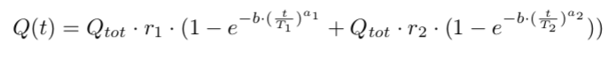
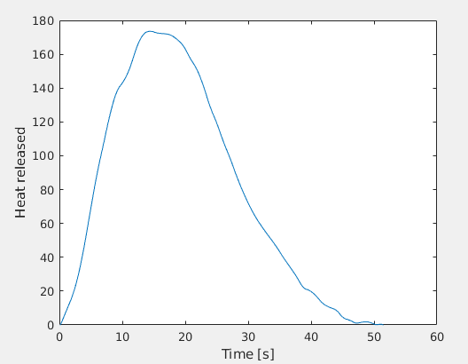

# Double Wiebe Superpostion using Gradient Descent
Matlab code for approximating difference in heat released of a disel engine given by exprimental data using the sum of two wiebe functions which parameters are deterimend by gradinet descent.

The approximated fuction is given by the following formula:
<p align="center">
  
</p>

```matlab
%Short version
data = wiebe(dQ)

%Long version
[data, Qtot] = wiebe(dQ, b, deltat)
```
### Input
#### Required:
- dQ - row vector that represents experimantal data of the difference in heat released of a disel engine as data points

#### Optional:
- b - maximum heat released - default: 6.908 
- deltat - time step used for sampling of experimental data - default: 0.1

### Output:
- data - row vector containting 6 elements: a<sub>1</sub>, T<sub>1</sub>, r<sub>1</sub>, a<sub>2</sub>, T<sub>2</sub>, <sub>3</sub>
- Qtot - total heat relesed 

<p align="center">
  
</p>
<p align="center">
Plot of sample input (dQ)
</p>

